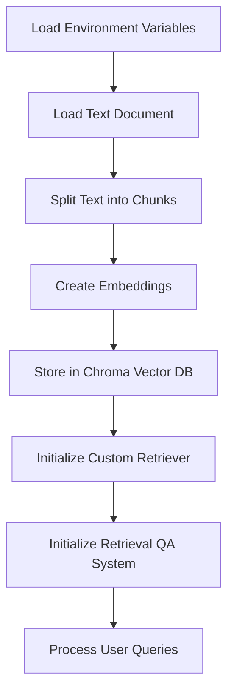

# Advanced Document Vectorization, Storage, and Query System

This project demonstrates an advanced system for loading text documents, splitting them into chunks, creating vector embeddings, storing them in a vector database, and performing question-answering using LangChain, OpenAI embeddings, and a custom retriever.

## How it works

1. **Environment Setup**: The script loads environment variables from a `.env` file.
2. **Document Loading**: A text file (`facts.txt`) is loaded using LangChain's `TextLoader`.
3. **Text Splitting**: The loaded document is split into smaller chunks using `CharacterTextSplitter`.
4. **Embedding Creation**: OpenAI's embedding model is used to create vector representations of the text chunks.
5. **Vector Storage**: The embeddings are stored in a Chroma vector database for efficient similarity search.
6. **Custom Retrieval**: A custom `RedundantFilterRetriever` is used to fetch relevant documents.
7. **Query Processing**: The system uses a retrieval-based question-answering model to respond to user queries based on the stored document embeddings.

## Project Structure

The project consists of three main Python files:

1. `main.py`: Handles the main execution flow, including document loading, database initialization, and the query loop.
2. `prompt.py`: Contains utility functions for creating embeddings, managing the vector store, and setting up the question-answering system.
3. `redundant_filter_retriever.py`: Implements a custom retriever for fetching relevant documents.

## Diagram



## Code Explanation

### main.py

This file orchestrates the entire process:

1. `load_and_split_document(file_path, chunk_size, chunk_overlap, separator)`:
   - Loads the text file and splits it into chunks.
   - Parameters allow customization of chunk size, overlap, and separator.

2. `initialize_or_load_chroma(file_path, chunk_size, chunk_overlap, separator, persist_directory)`:
   - Attempts to load an existing Chroma DB or creates a new one with document chunks.
   - Returns the vector store and embedding model.

3. `main()`:
   - The main function that ties everything together.
   - Initializes the environment, loads or creates the Chroma DB, sets up the retrieval system, and starts the query loop.

### prompt.py

This file contains utility functions for the QA system:

1. `create_prompt()`: Creates a PromptTemplate for the question-answering system.
2. `create_embeddings_model()`: Initializes the OpenAIEmbeddings model.
3. `load_environment()`: Loads environment variables from a .env file.
4. `store_in_chroma(chunks, embedding_model, persist_directory)`: Stores document chunks in a Chroma vector database.
5. `load_chroma_db_for_retrieval(embedding_model, persist_directory)`: Loads an existing Chroma database for retrieval.
6. `search_in_chroma(retriever, query, k)`: Searches the Chroma DB for relevant documents.
7. `create_retrieval_qa(retriever)`: Sets up the RetrievalQA system using the custom retriever and embedding model.
8. `query_loop(retrieval_qa, show_sources)`: Handles the interactive query loop for user input.

### redundant_filter_retriever.py

This file implements a custom retriever:

1. `RedundantFilterRetriever` class:
   - Inherits from `BaseRetriever` and `BaseModel`.
   - Implements `get_relevant_documents(query, num_results)` method to retrieve relevant documents using max marginal relevance search.
   - `aget_relevant_documents(query)` is a placeholder for future async implementation.

## Usage

1. Ensure you have the required dependencies installed:

   ```sh
   pip install python-dotenv langchain openai chromadb
   ```

2. Create a `.env` file in the project root with your OpenAI API key:

   ```sh
   OPENAI_API_KEY=your_api_key_here
   ```

3. Place your text document in the project directory as `facts.txt`.

4. Run the script:

   ```sh
   python main.py
   ```

5. Enter your queries when prompted. Type 'quit' to exit the program.

## How It All Works Together

1. The `main.py` script starts by loading environment variables and setting up the system.
2. It attempts to load an existing Chroma database or creates a new one by processing the document.
3. The script initializes the custom `RedundantFilterRetriever` and the retrieval QA system.
4. It enters a query loop where users can input questions.
5. For each query, the system:
   - Uses the custom retriever to fetch relevant document chunks from the vector database.
   - Employs the retrieval QA system to generate an answer based on the relevant chunks.
   - Displays the answer and optionally shows the source documents used.

## Advanced Features

1. **Custom Retriever**: The `RedundantFilterRetriever` uses max marginal relevance search to reduce redundancy in retrieved documents.
2. **Flexible Document Loading**: The system allows customization of chunk size, overlap, and separator when loading documents.
3. **Persistent Storage**: The Chroma database is persisted, allowing for reuse across multiple runs.
4. **Error Handling**: The system gracefully handles errors when loading the database, falling back to creating a new one if necessary.

## Note

This implementation uses OpenAI's embedding model and the GPT-3.5-turbo model for question-answering. Ensure you have sufficient API credits and comply with OpenAI's usage policies.
